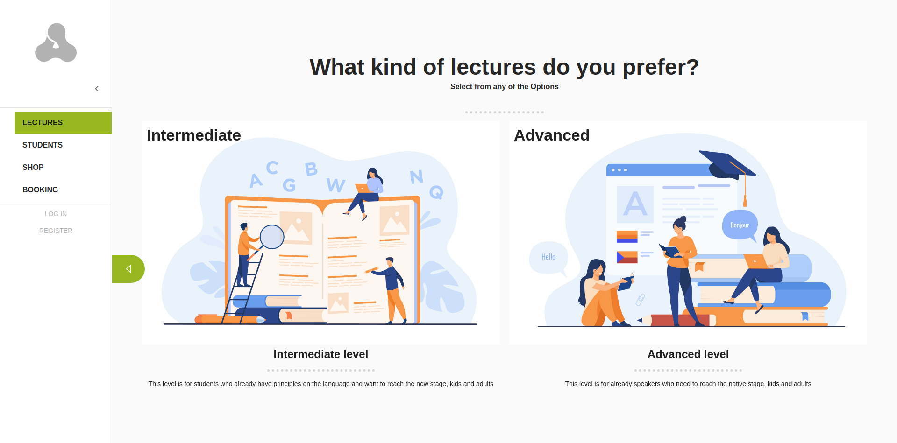

# Agile English

Agile English is a website in which you can book a lecture with a professional English teacher, created it in React with Redux, this single-page application uses an API build it in Ruby on Rails, here is the [Back-end repository](https://github.com/mricanho/ae-backend/tree/feature).

## Live demo

[live demo](http://miguel-ae-frontend.herokuapp.com/#/agile-english/types)

## Built With

- JavaScript
- HTML
- CSS
- React
- Redux
- Material-UI
- Package.json
- Jest
- Axios
- Thunk

## How to start the project from your Local environment

- Open your terminal and cd where you want to store the project
- Run the following command - `git clone https://github.com/mricanho/agile-english`
- Cd into the directory - `cd agile-english`
- Run `npm install` to install all dependencies
- On the console run `npx eslint --fix` to fix all the trailing space added by GitHub
- Run `npm start`, this automatically open your browser, and the app
- If not, open your browser manually and copy pase http://localhost:3000

## Author

👤 **Miguel Ricaño**

- Github: [@mricanho](https://github.com/mricanho)
- Linkedin: [Miguel Ricaño](https://www.linkedin.com/in/mricanho/)
- Website: [Live Website](https://www.miguelricano.me)

## 🤝 Contributing

Contributions, issues, and feature requests are welcome!

## Show your support

Give a star if you :star: like this project!

## Acknowledgments

- Microverse
- Design idea by [Murat Korkmaz on Behance](https://www.behance.net/gallery/26425031/Vespa-Responsive-Redesign)

## 📝 License

This project is [MIT](LICENSE) licensed.
